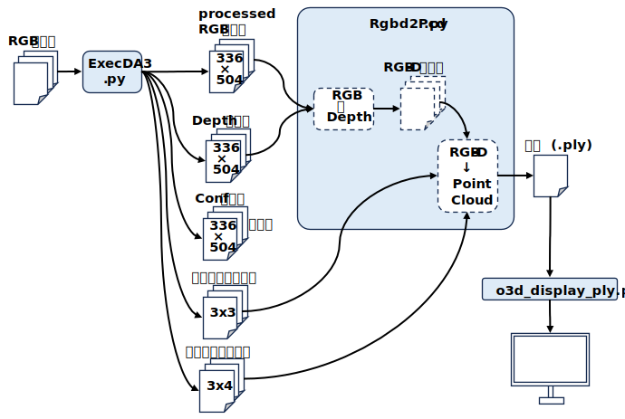
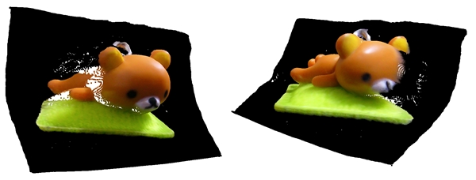
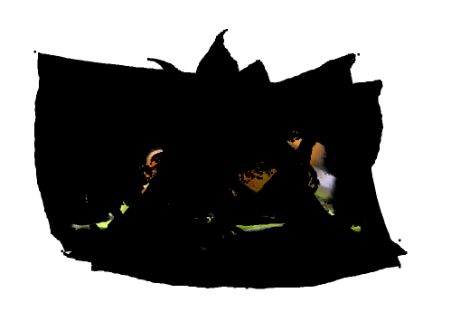
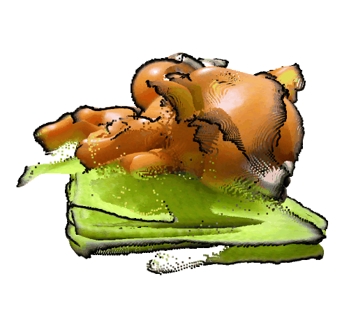
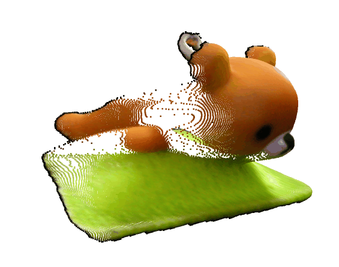
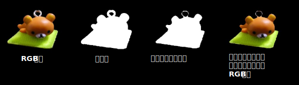
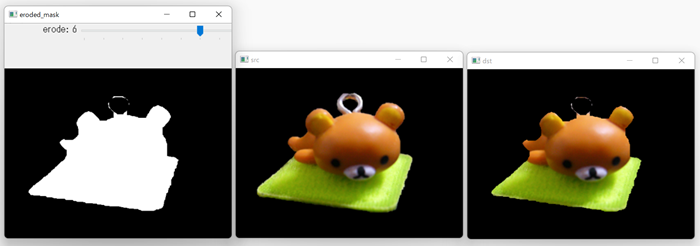

<html lang="ja">
    <head>
        <meta charset="utf-8" />
    </head>
    <body>
<h1>
Using DepthAnythingV3 as MVS
</h1>
<h2>なにものか？</h2>

Depth Anything V3を使って多視点ステレオを行うプログラムです。 
 
 
入力するRGB画像群の例 
 
 
Depth Anything V3を実行すると以下が得られる。 
・Processed RGB画像群 ･･･ AIモデルの解像度にリサイズされたRGB画像群 
・Depth画像群　　　　 ･･･ 各ピクセルの深度を推定したもの 
・Conf画像群　　　　　･･･ 各ピクセルの推定確度(今のところ使用せず) 
・内部パラメータ群　　･･･ ピクセル座標→カメラ座標の変換パラメータ群 
・外部パラメータ群　　･･･ カメラ座標→ワールド座標の変換パラメータ群 
 
Depth画像 / 内部パラメータ / 外部パラメータを使うとワールド座標に変換された点群が得られるが, 
各RGB画像には背景が写っており,  
 

 
 
そのまま合成すると, こうなってしまう。 

 
 
後処理で背景色の点群を削除しても以下のようになる。 

 
 

課題1) 境界付近の点群が背景色に汚染されている。 
課題2) 位置合わせが不完全 
 
合成前でもこんな感じ 

 

対策1) ピクセル座標の段階で境界付近の点を削る。 

 
つづく･･･ 
 
対策2) レジストレーション：未着手 

<h2>環境構築方法</h2>

[1] Depth Anything V3をダウンロード～解凍する 
　　<a href="https://github.com/ByteDance-Seed/Depth-Anything-3">https://github.com/ByteDance-Seed/Depth-Anything-3</a> 
　　Code --> Download ZIP 
 
　　Depth-Anything-3-main.zip を解凍する 
 
[2] Python実行環境を作成する 
　　conda create -n DA3 python=3.10 
　　conda activate DA3 
 
　　必要なモジュールをインストールする 
　　pip install -r requrements.txt

<h2>使い方</h2>

[0] 本github/src内のスクリプトを 
　　Depth-Anything-3-main/src 配下にコピーする 
 
[1] Depth Anything V3の推論を実行する 
　　python ExecDA3.py (画像群へのワイルドカード) 
　　(例) python ExecDA3.py input/*.png 
　　実行結果は result* フォルダに出力される。 
 
[2] 対策1)の侵食量を色々試して決める 
　　python trying_erode_level.py (RGB画像) 
　　※ (R,G,B)=(0,0,0)の領域をマスクと見なすので、そうなっていないRGB画像ではうまく動作しません。 
 
 

[3] Depth Anything V3の推論結果から点群を作成する 
　　python Rgbd2Pcd.py (推論結果を格納したフォルダ) 
　　(例) python Rgbd2Pcd.py result 

 
　　※ 対策1) はまだ適用されていません･･･ 
　　　 対策2) も･･･ 
 
[4] 点群を表示する 
　　python o3d_display_ply.py (点群ファイル) 

</body>
</html>
