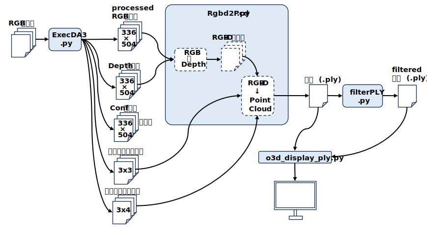

<html lang="ja">
    <head>
        <meta charset="utf-8" />
    </head>
    <body>
<h1>
Using DepthAnythingV3 as MVS
</h1>
<h2>なにものか？</h2>

Depth Anything V3を使って多視点ステレオを行うプログラムです。 
 
多視点画像の深度画像を点群にしてまとめてみたが･･･(VGGTの時よりひどい結果に) 
(いつか改善するかも知れないので)備忘録として･･･ 
・背景との境界が汚くなるので, 点群に透明度を持たせるか? 
・ICPか何かで位置合わせをしないと･･･ 
　　： 
 
入力画像 
 
 
点群の貼り合わせ結果 
 
 
カラーキーでPLYをフィルター 
 
 
1枚1枚の点群はどれほど悪くない。合成前に点群の縁(へり)のゴミを削ればよさそう。 
点群の縁(へり)はどうやって抽出するんだろう･･･ 
 

<h2>環境構築方法</h2>

[1] Depth Anything V3をダウンロード～解凍する 
　　<a href="https://github.com/ByteDance-Seed/Depth-Anything-3">https://github.com/ByteDance-Seed/Depth-Anything-3</a> 
　　Code --> Download ZIP 
 
　　Depth-Anything-3-main.zip を解凍する 
 
[2] Python実行環境を作成する 
　　conda create -n DA3 python=3.10 
　　conda activate DA3 
 
　　必要なモジュールをインストールする 
　　pip install -r requrements.txt

<h2>使い方</h2>

●ワークフロー

　・Processed RGB画像群 ･･･ AIモデルの解像度にリサイズされたRGB画像群 
　・Depth画像群　　　　 ･･･ 推定された奥行画像群 
　・Conf画像群　　　　　･･･ ピクセル毎の推定確度(今のところ使用せず) 
　・内部パラメータ群　　･･･ 推定されたカメラ内部パラメータ 
　・外部パラメータ群　　･･･ 推定されたカメラ外部パラメータ 

[0] 本github/src内のスクリプトを 
　　Depth-Anything-3-main/src 配下にコピーする 
 
[1] Depth Anything V3の推論を実行する 
　　python ExecDA3.py (画像群へのワイルドカード) 
　　(例) python ExecDA3.py input/*.png 
　　実行結果は result* フォルダに出力される。 
 
[2] Depth Anything V3の推論結果から点群を作成する 
　　python Rgbd2Pcd.py (推論結果を格納したフォルダ) 
　　(例) python Rgbd2Pcd.py result 
 
[3] 点群を表示する 
　　python o3d_display_ply.py (点群ファイル) 

    </body>
</html>
